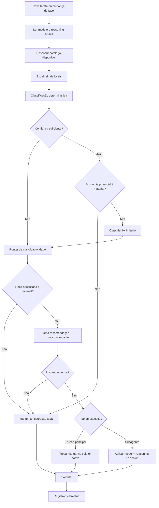

# Codex Cost Optimizer


> Roteamento local de `model + reasoning` para o Codex, orientado a custo, com autorização explícita do usuário e telemetria de economia.

O **Codex Cost Optimizer** nasceu de um problema simples: usar o modelo mais poderoso em todas as etapas de desenvolvimento pode consumir muito mais créditos/tokens do que o necessário.

Uma investigação complexa pode justificar um modelo frontier com reasoning alto. Depois que a causa raiz foi encontrada, porém, a implementação pode virar uma tarefa mecânica que um modelo mais econômico consegue executar com segurança.

A proposta deste projeto é fazer essa decisão de forma sistemática:

**usar o modelo mais barato capaz de executar a próxima etapa com segurança, sem aumentar materialmente o risco de erro ou retrabalho.**

---

## O problema

Em uma sessão real de desenvolvimento, a complexidade muda ao longo do trabalho:

```text
Investigar bug desconhecido
        ↓
modelo mais capaz / reasoning alto
        ↓
causa raiz encontrada
        ↓
implementação definida
        ↓
modelo intermediário
        ↓
testes e alterações mecânicas
        ↓
modelo econômico
```

Sem roteamento, a sessão pode continuar usando o modelo mais caro até o final — inclusive em buscas simples, testes, documentação, pequenas alterações ou subagentes.

O Cost Optimizer tenta reduzir esse desperdício sem transformar economia em retrabalho.

---

## A proposta da Skill

`SKILL.md` funciona como a política de decisão do optimizer dentro de workflows agentic.

Ela orienta o Codex a:

1. avaliar a configuração atual antes de trabalhos relevantes;
2. reavaliar somente quando houver mudança objetiva de fase;
3. descobrir os modelos realmente disponíveis no runtime;
4. classificar a próxima etapa localmente sempre que possível;
5. recomendar **uma única configuração** de `model + reasoning`;
6. explicar por que a troca faz sentido;
7. informar se a mudança tende a reduzir ou aumentar custo;
8. exigir autorização explícita para toda troca;
9. usar o modelo mais capaz quando economizar aumentaria significativamente o risco de retrabalho;
10. registrar consumo e economia estimada sem armazenar código-fonte ou prompts completos.

A Skill não possui um modelo favorito. A política é baseada em **capacidade necessária, risco, ambiguidade, contexto, custo e disponibilidade real**.

---

## Princípios

- **Zero-token first** — a maioria das decisões deve ser feita por regras locais em Python, sem chamar IA.
- **Dynamic catalog** — nenhum modelo é assumido como disponível; o catálogo vem do runtime do Codex.
- **Explicit approval** — nenhuma mudança de modelo ou reasoning acontece sem autorização do usuário.
- **One recommendation** — o usuário não recebe uma lista de modelos para decidir manualmente.
- **Cost-aware, not cost-blind** — o mais barato nem sempre é o mais econômico se gerar retrabalho.
- **Fail-safe** — se estado, catálogo ou confirmação não forem confiáveis, a configuração atual é mantida.
- **No global mutation** — o optimizer não altera `config.toml` global para roteamento temporário.
- **Privacy by design** — telemetria guarda metadados, não o conteúdo do projeto.

---

## Arquitetura conceitual

```text
┌───────────────────────┐
│       CODEX IDE       │
└──────────┬────────────┘
           │
           │ tarefa
           ▼
┌───────────────────────┐
│       SKILL.md        │
│   Cost Optimizer      │
└──────────┬────────────┘
           │
           ▼
┌───────────────────────┐
│     Router Local      │
│       Python          │
│                       │
│ maioria: 0 tokens     │
└──────────┬────────────┘
           │
           ▼
     precisa trocar?
       /       \
     não       sim
      │         │
      │         ▼
      │   explicar motivo
      │         │
      │         ▼
      │   pedir autorização
      │         │
      │   ┌─────┴───────────────┐
      │   │                     │
      │   ▼                     ▼
      │ THREAD PRINCIPAL     SUBAGENTE
      │   │                     │
      │   ▼                     ▼
      │ troca no seletor     model + reasoning
      │ nativo do Codex      no spawn/dispatch
      │   │                     │
      │   ▼                     ▼
      │ confirmar estado     confirmar config
      │   │                     │
      └───┴──────────┬──────────┘
                     ▼
                  executar
                     │
                     ▼
                 telemetria
```

### Por que a thread principal é diferente?

A API pública atual não oferece a uma Skill/script externo um canal confiável para alterar silenciosamente o `model + reasoning` da mesma thread já aberta no VS Code.

Por isso a V1 **não usa hacks**, automação de cliques, banco interno do Codex ou alteração temporária de configuração global.

Na thread principal, quando uma troca é aprovada, o optimizer retorna uma instrução `manual_switch_required` e o usuário altera a configuração no seletor nativo do Codex.

Para subagentes, quando o runtime suporta configuração independente, o modelo pode ser definido explicitamente no momento do spawn/dispatch.

---

## Fluxo de decisão



---

## Como o router decide

A classificação usa sinais como:

- existência de SPEC;
- causa raiz conhecida ou desconhecida;
- quantidade estimada de arquivos;
- mudança entre módulos;
- erro inesperado;
- risco da tarefa;
- tamanho esperado do trabalho;
- risco de replay de contexto;
- tarefa mecânica, implementação, investigação ou revisão;
- origem da execução — thread principal, Skill, plugin ou subagente.

Exemplo conceitual:

| Fase | Exemplo | Estratégia |
|---|---|---|
| Mecânica | documentação, busca simples, pequena alteração | modelo econômico / reasoning baixo |
| Implementação definida | SPEC pronta, causa conhecida | modelo intermediário |
| Engenharia complexa | múltiplos módulos e integrações | modelo mais capaz |
| Investigação | causa desconhecida, comportamento divergente | modelo frontier / reasoning alto |

Os nomes dos modelos **não são hardcoded como regra de negócio**. O router escolhe entre os modelos retornados pelo runtime atual.

---

## Zero-token first

O optimizer não deve gastar tokens apenas para decidir como economizar tokens.

Fluxo padrão:

```text
Regras locais
    ↓
confiança suficiente?
    ├─ sim → decisão com 0 tokens de IA
    └─ não
         ↓
    benefício material?
         ├─ não → manter configuração
         └─ sim → classifier barato e limitado
```

Meta de projeto:

- **> 90%** das decisões resolvidas localmente;
- classifier IA somente para casos realmente ambíguos;
- payload do classifier somente com metadados;
- aproximadamente **≤ 1.000 tokens de entrada** e **≤ 80 tokens de saída** por classificação;
- overhead do optimizer alvo **< 1%** em sessões representativas.

---

## Modelos disponíveis

O catálogo é descoberto dinamicamente pelo SDK do Codex.

```powershell
cco inspect
```

Exemplo de saída real:

```text
current_model=unavailable
current_effort=unavailable

gpt-5.6-sol: low,medium,high,xhigh,max,ultra
gpt-5.6-terra: low,medium,high,xhigh,max,ultra
gpt-5.6-luna: low,medium,high,xhigh,max
gpt-5.5: low,medium,high,xhigh
gpt-5.4: low,medium,high,xhigh
gpt-5.4-mini: low,medium,high,xhigh
gpt-5.3-codex-spark: low,medium,high,xhigh
```

Se um modelo não estiver disponível para a conta/runtime atual, ele simplesmente não participa da decisão.

---

## Instalação

### Requisitos

- Python 3.10+
- Codex autenticado no ambiente

### Instalar em modo de desenvolvimento

```powershell
git clone https://github.com/Peterson-Benhame/codex-cost-optimizer.git
cd codex-cost-optimizer
python -m pip install -e ".[codex,dev]"
```

### Executar testes

```powershell
pytest
```

### Inspecionar o ambiente

```powershell
cco inspect
```

---

## Uso

### Inspecionar uma thread existente

```powershell
cco inspect --thread-id <thread-id>
```

### Avaliar/executar uma tarefa

```powershell
cco run "Adicione XML comments" `
  --model gpt-5.6-sol `
  --effort high `
  --files 1 `
  --risk low
```

Se o modelo atual estiver adequado, a tarefa segue normalmente.

Se a thread principal deveria usar outra configuração e o usuário autorizar a recomendação, a V1 retorna:

```text
manual_switch_required=true
target_model=gpt-5.3-codex-spark
target_effort=low
action=altere model/reasoning no seletor nativo do Codex e confirme o estado antes de continuar
```

A tarefa não é executada silenciosamente com uma configuração diferente da autorizada.

---

## Subagentes, Skills e plugins

Subagentes são uma fonte importante de custo porque podem herdar automaticamente o modelo mais caro da thread pai.

O Cost Optimizer foi desenhado para registrar e, quando suportado pelo runtime, rotear cada subagente individualmente.

Exemplo:

```text
Thread principal
Sol / High
│
└── Superpowers
    └── dispatching-parallel-agents
        ├── investigator → Terra / Medium
        ├── explorer     → Spark / Low
        └── tester       → Luna / Low
```

Quando identificável, a telemetria registra:

- Skill/plugin de origem;
- capability que criou o agente;
- nome e ID do agente;
- agente pai;
- modelo/reasoning do pai;
- modelo/reasoning efetivamente usado;
- tokens consumidos;
- custo calculado;
- custo contrafactual estimado caso o agente tivesse herdado o modelo pai;
- economia estimada.

Se a origem não puder ser identificada com segurança, ela é registrada como `unknown` — nunca inferida silenciosamente.

---

## Telemetria

A telemetria é local e orientada a medir se o optimizer realmente está economizando.

Ela pode registrar:

```text
session_id
thread_id
fase
modelo atual
reasoning atual
modelo recomendado
reasoning recomendado
autorizado
configuração confirmada
origem da decisão
tokens de entrada
tokens em cache
tokens de saída
reasoning tokens, quando disponíveis
custo estimado
economia estimada
```

### Privacidade

A telemetria **não deve armazenar**:

- código-fonte;
- prompts completos;
- respostas completas do Codex;
- arquivos do projeto;
- segredos;
- conteúdo de documentos do repositório.

Local padrão:

**Windows**

```text
%LOCALAPPDATA%\codex-cost-optimizer\telemetry\events.jsonl
```

**Linux/macOS**

```text
${XDG_STATE_HOME:-~/.local/state}/codex-cost-optimizer/events.jsonl
```

---

## Custo real vs. economia estimada

O projeto diferencia métricas observadas de contrafactuais.

```text
tokens_actual
cost_estimated
parent_model
cost_if_parent_model_estimated
savings_estimated
savings_percent_estimated
```

Exemplo:

> “Este subagente usou Spark e consumiu X tokens”

pode ser uma observação real do runtime.

Já:

> “Se tivesse herdado Sol/High teria custado Y”

é um **contrafactual estimado** e deve ser apresentado dessa forma.

---

## Fail-safe

O optimizer é uma camada de otimização, não um ponto único de falha.

Se ocorrer qualquer uma destas situações:

- catálogo indisponível;
- estado atual desconhecido;
- modelo recomendado desapareceu;
- reasoning não suportado;
- aplicação da configuração não confirmada;
- runtime não suporta roteamento independente do subagente;

então:

```text
NENHUMA TROCA SILENCIOSA
        ↓
manter configuração atual/herdada
        ↓
registrar a limitação
        ↓
continuar o trabalho normal do Codex
```

---

## Limites atuais da V1

A V1 deliberadamente **não**:

- instala extensão no VS Code;
- automatiza cliques no seletor de modelo;
- modifica banco de dados interno do Codex;
- altera `config.toml` global para uma troca temporária;
- assume que toda Skill/plugin permite interceptar subagentes;
- promete alteração transparente da thread principal já aberta no VS Code.

Esses limites evitam que uma otimização de custo introduza comportamento frágil ou não suportado.

---

## Estrutura do projeto

```text
codex-cost-optimizer/
├── SKILL.md
├── README.md
├── pyproject.toml
├── references/
│   ├── model-policy.json
│   └── model-policy.md
├── src/
│   └── codex_cost_optimizer/
│       ├── approval.py
│       ├── catalog.py
│       ├── classifier.py
│       ├── cli.py
│       ├── codex_runtime.py
│       ├── domain.py
│       ├── fallback_classifier.py
│       ├── materiality.py
│       ├── pricing.py
│       ├── routing.py
│       ├── service.py
│       ├── signals.py
│       └── telemetry.py
└── tests/
```

---

## Roadmap

### V1 — Core

- catálogo dinâmico;
- classificação local;
- política custo/capacidade;
- autorização explícita;
- telemetria;
- fallback IA limitado;
- fail-safe.

### V1 — Native routing boundary

- thread principal: recomendação + autorização + troca pelo seletor nativo;
- subagentes: configuração explícita no spawn quando suportado;
- nenhuma extensão adicional no VS Code.

### Próximos passos

- validar roteamento real de subagentes do Codex;
- integrar metadados de origem de Skills/plugins;
- medir economia real em sessões longas;
- calibrar política com base em telemetria;
- adicionar CI para validar Windows/Linux;
- evoluir a integração quando o Codex expuser APIs públicas adicionais para roteamento da thread principal.

---

## Objetivo

O sucesso do Codex Cost Optimizer não é “usar sempre o modelo mais barato”.

É reduzir o **custo total do trabalho**:

```text
custo do modelo
+ tokens utilizados
+ reasoning
+ replay de contexto
+ subagentes
+ retrabalho
```

A melhor decisão é a configuração de menor custo que ainda tenha capacidade suficiente para completar a próxima etapa de forma confiável.
